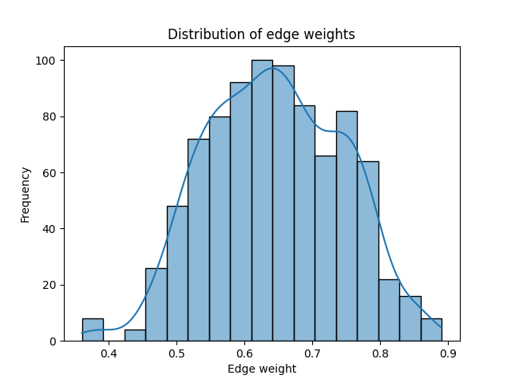
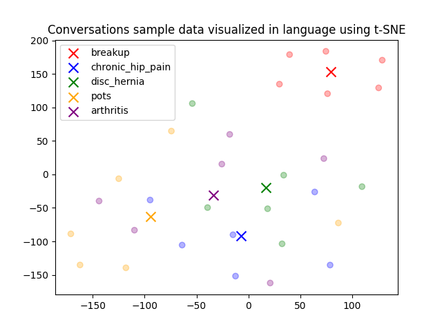
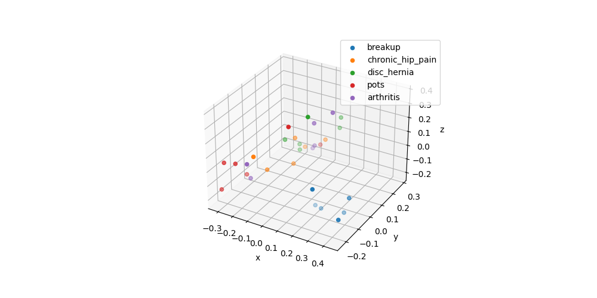

# svaeva-evaluation

<div align="center">

[](https://github.com/elacosse/svaeva-evaluation/pulls?utf8=%E2%9C%93&q=is%3Apr%20author%3Aapp%2Fdependabot)

[](https://github.com/charliermarsh/ruff)
[](https://github.com/PyCQA/bandit)
[](https://github.com/elacosse/svaeva-evaluation/blob/master/.pre-commit-config.yaml)
[](https://github.com/elacosse/svaeva-evaluation/releases)
[](https://github.com/elacosse/svaeva-evaluation/LICENSE)


`svaeva-evaluation` is a Python cli/package

</div>

## Very first steps

### Prepare your .env file with appropriate parameters and API keys

The following ```.env``` file with the following variables _must_ be placed in the most parent directory of this repository 

```bash
# Redis config
REDIS_HOST=127.0.0.1 # default
REDIS_PORT=6379 # default
REDIS_DB_INDEX=0 # default
REDIS_USER=<YOUR REDIS USER (OPTIONAL)>
REDIS_PASSWORD=<YOUR REDIS PASSWORD (OPTIONAL)>
REDIS_OM_URL=redis://127.0.0.1:6379/0 # Redis URL for redis-om use

# External API keys
OPENAI_API_KEY=<YOUR OPENAI API KEY>
ELEVEN_API_KEY=<YOUR ELEVEN LABS API KEY>

# For svaeva-evaluation
RANDOM_SEED=42
PLATFORM_ID=svaeva-redux
GROUP_ID=consonancia
CONVERSATION_ID=sim-consonancia
INTERACTION_COUNT=0
```

### Initialize your code

1. If you don't have `Poetry` installed run:

```bash
make poetry-download
```

2. Initialize poetry and install:

```bash
make install

```

## 🚀 Usage

### Generate Sample Conversation Data (For ConsonancIA)

Easily and asynchronously generate sample conversation data to appropriately store in the database to play with.
(Note: svaeva-redux platform must be up and running!)

```bash
python svaeva_evaluation/simulation/consonancia.py
```

##### Retrieve most connected user and save their conversation to  ```data/conversations/best_node_conversation.txt```

```bash
svaeva-evaluation select
```

##### Save current network graph to ```data/network/network.html```

```bash
svaeva-evaluation network
```

<iframe src="https://github.com/elacosse/svaeva-evaluation/blob/master/assets/network.html" width="100%" height="500px"></iframe>


##### Get most connected users's audio generation and save to  ```data/audio/*```

```bash
svaeva-evaluation audio
```

##### Plot tSNE embeddings and edge distribution and save to ```data/plots/*```
```bash
svaeva-evaluation plot
```

###### Sample Edge Distribution

###### t-SNE Embeddings

###### PCA Embeddings 3D Projection



### Makefile usage

[`Makefile`](https://github.com/elacosse/svaeva-evaluation/blob/master/Makefile) contains a lot of functions for faster development.

<details>
<summary>1. Download and remove Poetry</summary>
<p>

To download and install Poetry run:

```bash
make poetry-download
```

To uninstall

```bash
make poetry-remove
```

</p>
</details>

<details>
<summary>2. Install all dependencies and pre-commit hooks</summary>
<p>

Install requirements:

```bash
make install
```

Pre-commit hooks coulb be installed after `git init` via

```bash
make pre-commit-install
```

</p>
</details>

<details>
<summary>3. Codestyle</summary>
<p>

Automatic formatting uses `pyupgrade` and `ruff`.

```bash
make codestyle

# or use synonym
make formatting
```

Codestyle checks only, without rewriting files:

```bash
make check-codestyle
```

> Note: `check-codestyle` uses `ruff` and `darglint` library

Update all dev libraries to the latest version using one comand

```bash
make update-dev-deps
```

</p>
</details>

<details>
<summary>4. Code security</summary>
<p>

```bash
make check-safety
```

This command launches `Poetry` integrity checks as well as identifies security issues with `Safety` and `Bandit`.

```bash
make check-safety
```

</p>
</details>

<details>
<summary>5. Type checks</summary>
<p>

Run `mypy` static type checker

```bash
make mypy
```

</p>
</details>

<details>
<summary>6. Tests with coverage badges</summary>
<p>

Run `pytest`

```bash
make test
```

</p>
</details>

<details>
<summary>7. All linters</summary>
<p>

Of course there is a command to ~~rule~~ run all linters in one:

```bash
make lint
```

the same as:

```bash
make test && make check-codestyle && make mypy && make check-safety
```

</p>
</details>

<details>
<summary>8. Docker</summary>
<p>

```bash
make docker-build
```

which is equivalent to:

```bash
make docker-build VERSION=latest
```

Remove docker image with

```bash
make docker-remove
```

More information [about docker](https://github.com/elacosse/svaeva-evaluation/tree/master/docker).

</p>
</details>

<details>
<summary>9. Cleanup</summary>
<p>
Delete pycache files

```bash
make pycache-remove
```

Remove package build

```bash
make build-remove
```

Delete .DS_STORE files

```bash
make dsstore-remove
```

Remove .mypycache

```bash
make mypycache-remove
```

Or to remove all above run:

```bash
make cleanup
```

</p>
</details>

## 📈 Releases

You can see the list of available releases on the [GitHub Releases](https://github.com/elacosse/svaeva-evaluation/releases) page.

We follow [Semantic Versions](https://semver.org/) specification.

We use [`Release Drafter`](https://github.com/marketplace/actions/release-drafter). As pull requests are merged, a draft release is kept up-to-date listing the changes, ready to publish when you’re ready. With the categories option, you can categorize pull requests in release notes using labels.

### List of labels and corresponding titles

|               **Label**               |  **Title in Releases**  |
| :-----------------------------------: | :---------------------: |
|       `enhancement`, `feature`        |       🚀 Features       |
| `bug`, `refactoring`, `bugfix`, `fix` | 🔧 Fixes & Refactoring  |
|       `build`, `ci`, `testing`        | 📦 Build System & CI/CD |
|              `breaking`               |   💥 Breaking Changes   |
|            `documentation`            |    📝 Documentation     |
|            `dependencies`             | ⬆️ Dependencies updates |

You can update it in [`release-drafter.yml`](https://github.com/elacosse/svaeva-evaluation/blob/master/.github/release-drafter.yml).

GitHub creates the `bug`, `enhancement`, and `documentation` labels for you. Dependabot creates the `dependencies` label. Create the remaining labels on the Issues tab of your GitHub repository, when you need them.

## 🛡 License

This project is licensed under the terms of the `MIT` license. See [LICENSE](https://github.com/elacosse/svaeva-evaluation/blob/master/LICENSE) for more details.

## 📃 Citation

```bibtex
@misc{svaeva-evaluation,
  author = {Eric Lacosse},
  title = {`svaeva-evaluation` is a Python cli/package},
  year = {2024},
  publisher = {GitHub},
  journal = {GitHub repository},
  howpublished = {\url{https://github.com/elacosse/svaeva-evaluation}}
}
```

